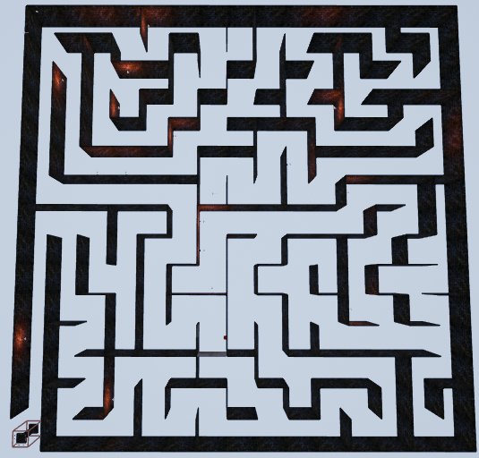
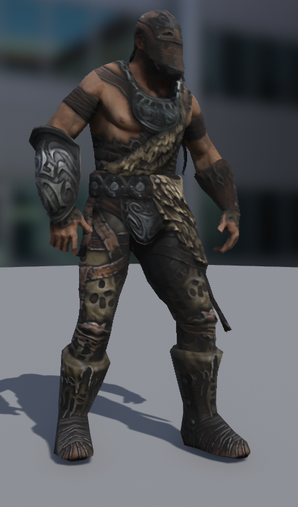
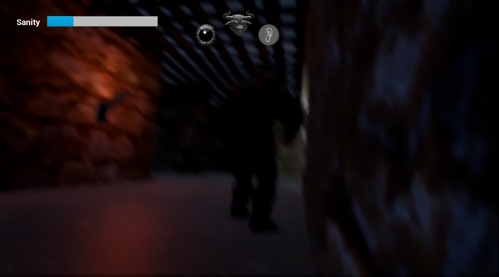
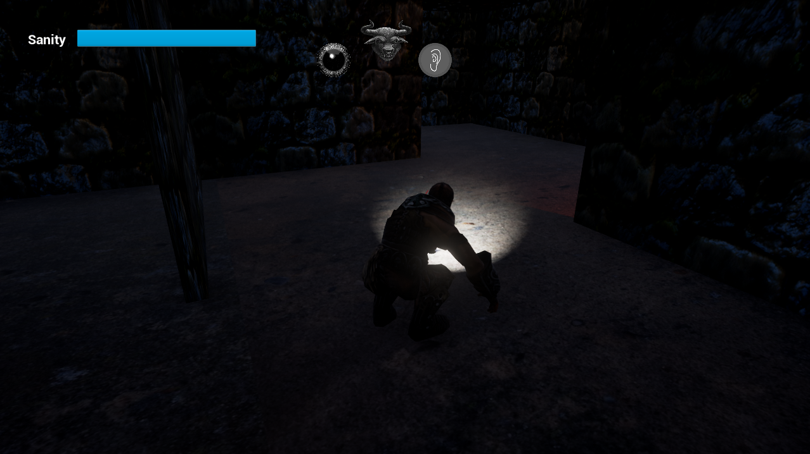
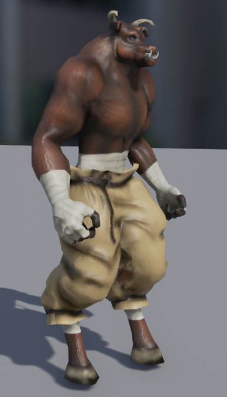
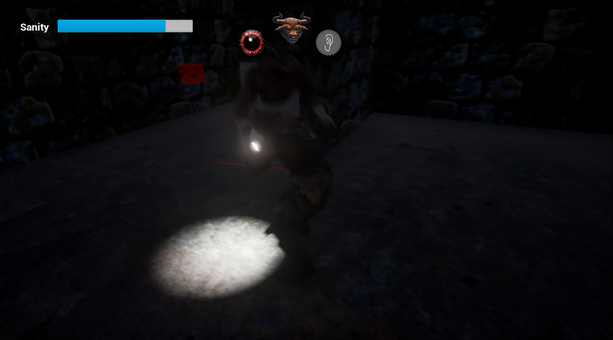

# MazeChase

> Unreal Engine 4 survival prototype where you sneak through a procedural labyrinth, juggle sanity, and outwit a FMOD-driven minotaur.

## Highlights

- Procedurally generated labyrinth built at runtime by `ALabyrinth` (`Source/MazeChase/Private/Labyrinth.cpp`) with configurable size, doors, torches, and spawn points.
- Stealth-focused player controller (`AMazeChaseCharacter`) with sanity mechanics, torchlight, contextual interactions, and FMOD-enabled jump/shout cues.
- Behavior-tree driven minotaur AI that patrols random targets, senses noise via `UPawnSensingComponent`, and transitions between patrol, chase, and kill states.
- Fully diegetic UI (UMG widgets) for menus, HUD, win/lose screens plus blueprint-driven VFX post-process for sanity feedback.
- Integrated FMOD Studio project (`MazeChaseFMOD`) powering ambient loops, door grime, footsteps, and roars with randomization and distance attenuation.

## Core Loop & Mechanics

### Survival objective

You spawn somewhere inside a 15x15 labyrinth and must locate the illuminated exit column before the minotaur reaches you. Doors and switches gate shortcuts; torches and a personal flashlight are your only sources of light.

### Sanity & immersion

`AMazeChaseCharacter` tracks `nervousness_` (see `MazeChaseCharacter.cpp`). Sprinting, shouting, or being close to the minotaur raises the meter, which in turn:

- Shakes and tilts the camera (drunk effect injected in `MoveForward`).
- Increases lateral drift, making navigation harder.
- Triggers post-process materials (configured in Blueprints) and audio cues.

Sanity gradually recovers when you slow down, incentivising deliberate movement.

### Procedural labyrinth

`ALabyrinth` owns a 2D array of `Cell` structs that start with all four walls. A depth-first carve (`generateModel`) removes walls until every cell is connected, guaranteeing a solvable maze. During construction it:

- Spawns wall meshes aligned to each cell face (`raiseWalls`).
- Destroys walls according to the carved model (`carveWalls`).
- Marks a random border cell as the exit and spawns the `AExitSign`.
- Optionally adds `ADoor`/`ADoorButton` pairs and `Torch` actors, as well as patrol target points for the minotaur.

Designers can regenerate the maze per level, delete generated actors, or bake a maze and remove the generator afterward.

### Doors, buttons, and torches

`ADoorButton` holds references to one or more `ADoor` actors. When the player lines up the crosshair with a button (`AMazeChaseCharacter::Tick` raycasts 100 units forward) and presses `E`, linked doors begin their open/close timers, play FMOD grind sounds (`ADoor::Tick`), and eventually return to their closed state.

### Minotaur AI

The villain (`AMinotaur`) combines:

- `UPawnSensingComponent` for 25° vision cones and footstep/shout hearing callbacks (`OnSeePawn`, `OnHearNoise`).
- Behavior Tree tasks/services (see `Core/AI`) that update blackboard values, select the next patrol node, and chase the player reference as long as it is valid.
- `AMinotaurController` which boots the behavior tree (`BehaviorTreeComp->StartTree`).

The AI chases until `chase_time_` expires, then falls back to patrolling randomly generated target points the labyrinth spawns.

### Audio

All music/SFX are authored in FMOD Studio 1.09 and loaded through the bundled `Plugins/FMODStudio`. `MazeChaseFMOD/MazeChaseFMOD.fspro` contains:

- Ambient mixes with low-tempo drones.
- Randomized footsteps and roars.
- Door grind loops that fade as the actor stops moving.

`MazeChase.Build.cs` links the FMOD module; both runtime and editor builds expect FMOD banks under `Content/FMOD/Desktop`.

## Controls

| Action            | Binding (keyboard/mouse) | Notes |
|-------------------|--------------------------|-------|
| Move              | `WASD` / Arrow keys      | Movement is relative to camera forward. |
| Look              | Mouse                    | Mouse sensitivity defined in `Config/DefaultInput.ini`. |
| Jump              | `Space`                  | Triggers FMOD jump event. |
| Interact          | `E`                      | Press doors buttons when raycast finds `BP_DoorButton`. |
| Run               | `Left Shift`             | +50% speed, adds noise & sanity drain. |
| Sneak             | `Left Ctrl`              | 50% speed, minimal noise. |
| Shout             | `Q`                      | Massive noise spike that lures the minotaur. |
| Torchlight        | `L`                      | Toggles the head-mounted spotlight. |
| Pause             | `P`                      | Shows pause widget (blueprint). |
| Toggle torch widget | `TorchLight` action    | Also bound to controllers (see config). |

Gamepad equivalents follow Unreal defaults (Face Bottom = jump, sticks = move/look).

## Repository Tour

- `Source/MazeChase/` – C++ gameplay modules (characters, labyrinth, AI tasks, UI stubs).
- `Content/` – Blueprints, meshes, materials, animations, maps (`MazeChaseGame.umap`, `MainMenu.umap`), UI assets.
- `Config/` – Engine, input, and gameplay defaults (notably `DefaultInput.ini`).
- `Plugins/FMODStudio/` – FMOD Unreal integration binaries, sources, and docs.
- `MazeChaseFMOD/` – FMOD Studio project plus raw audio assets and metadata.
- `Screenshots/` – Captures used in documentation (hero, minotaur, sanity UI, etc.).
- `DOCS/` – Full design & technical documentation (`MazeChase.pdf`, `.docx`, `.pptx`).
- `Binaries/`, `Intermediate/`, `Saved/` – Generated artifacts (retain for reference; rebuild when packaging).
- `TODO.txt` – Historical backlog of polish ideas (lighting, HUD rewrite, etc.).

## Requirements

- Windows 10 with Visual Studio 2015+ toolchain (C++14 / v140) or newer toolchain set through the project settings.
- Unreal Engine **4.13.x** (project `EngineAssociation` is `4.13`; newer engines may require migration).
- FMOD Studio **1.09.01** for editing/baking banks (runtime banks already included).
- GPU comparable to GTX 960 and 8 GB RAM (per original target specs).

## Getting Started

1. **Clone / download** this repository, preserving folder structure (FMOD plugin expects relative paths).
2. **Install dependencies**
   - Unreal Engine 4.13.x via Epic Launcher.
   - Visual Studio with C++ workload (or just build from the editor).
   - FMOD Studio 1.09 if you plan to edit audio.
3. **Generate project files** (if building from source):
   - Run `GenerateVisual.bat` or right-click `MazeChase.uproject` → *Generate Visual Studio project files*.
   - Open `MazeChase.sln`, set `MazeChase` as startup, and build Win64 Development Editor.
4. **Open in the editor**
   - Launch `MazeChase.uproject`.
   - Set `MazeChaseGame.umap` as the default game map and `MainMenu.umap` as the entry map (configured via `Project Settings → Maps & Modes` if needed).
   - Press *Play* in-editor. Each PIE session regenerates a new maze via `BP_Labyrinth`.
5. **Package / ship**
   - `File → Package Project → Windows (64-bit)`.
   - Ensure `Content/FMOD` contains up-to-date banks and that `Binaries/Win64` ships alongside FMOD DLLs supplied in `Plugins/FMODStudio/Binaries`.

### FMOD workflow

1. Install FMOD Studio 1.09.01 (matching plugin version).
2. Open `MazeChaseFMOD/MazeChaseFMOD.fspro`.
3. Modify events/banks as needed.
4. Build banks (*File → Build*). Output should land in `MazeChase/MazeChaseFMOD/Desktop`. Copy or set the build directory to `MazeChase/Content/FMOD/Desktop`.
5. In Unreal, trigger *FMOD → Refresh Banks* to reload metadata.

### Useful editor actors

- `BP_Labyrinth` (or `ALabyrinth` in C++): configure `wall_size_`, number of patrol points, torches, and door counts.
- `BP_Minotaur` / `AMinotaur`: adjust `PawnSensing` radii, `chase_time_`, and movement speed.
- `BP_Door` + `BP_DoorButton`: pair doors with buttons by populating `linked_doors_`.
- `BP_Hero` (derived from `AMazeChaseCharacter`): tweak sanity caps, FMOD jump event, step loudness, etc.

## Documentation & Media

- Full design and technical write-up lives under `DOCS/MazeChase.pdf` (exported to `.docx` and `.pptx` for slides). It covers influences, game rules, architecture diagrams, and designer guides.
- `Screenshots/*.png` showcase crouching, sanity UI, maze overview, enemy closeups, and collectibles. Use them in GitHub issues or marketing as needed:
  - `Screenshots/hero.png`
  - `Screenshots/minotaur.png`
  - `Screenshots/lowsanity.png`
  - `Screenshots/minotaurfood.png`

## Roadmap & Known Work

Historical TODO items (`TODO.txt`) include:

- Better hero/minotaur collision handling.
- Audio mute and richer pause menu.
- Migrating remaining Blueprint logic back into C++ (HUD, layered level setup).
- Lighting polish (dynamic torches, atmospheric fog) and door animations.
- Extended mechanics (traps, multiple minotaurs, customizable maze sizes).

Consider triaging these if you plan to continue development.

## License & Credits

- Code and project files are distributed under the **GNU GPL v3** (`LICENSE`).
- Unreal Engine assets remain under Epic's EULA; FMOD binaries fall under Firelight Technologies' license.
- Audio samples inside `MazeChaseFMOD/Assets` originate from freesound.org contributors (see filenames for attribution seeds such as `202504__xanco123__dark-ambient-music-1-the-original.mp3`).
- Original coursework, design, and implementation by Marcos Vázquez Rey (ESAT 2017). This README synthesizes the bundled documentation for GitHub distribution.
